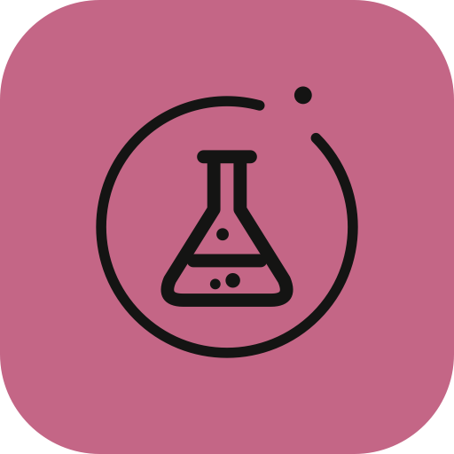
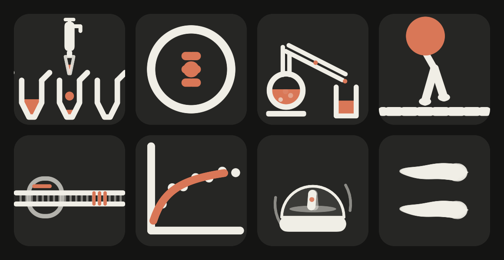
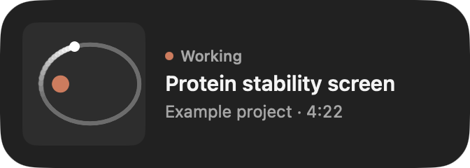
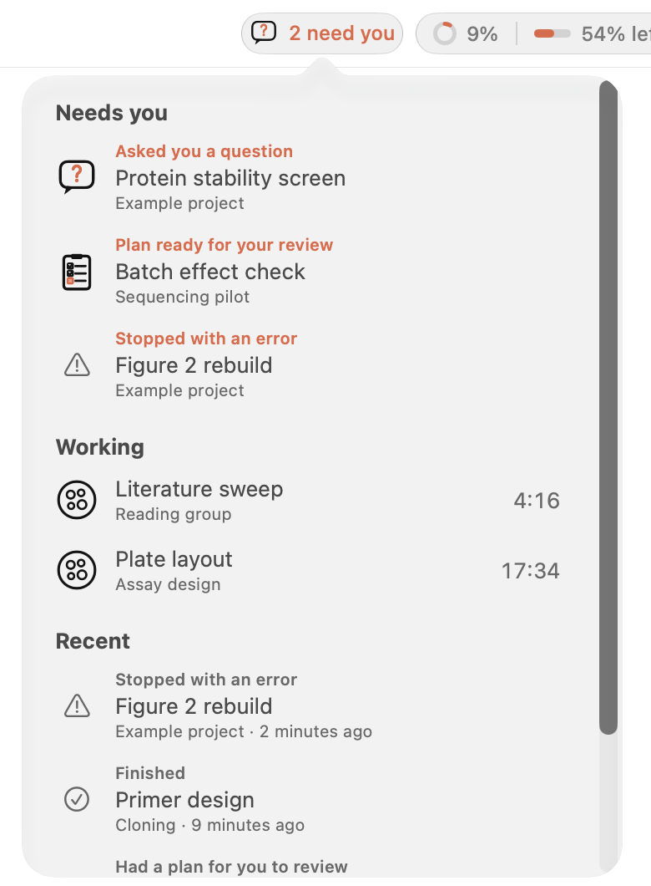
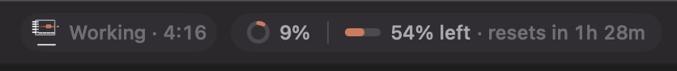
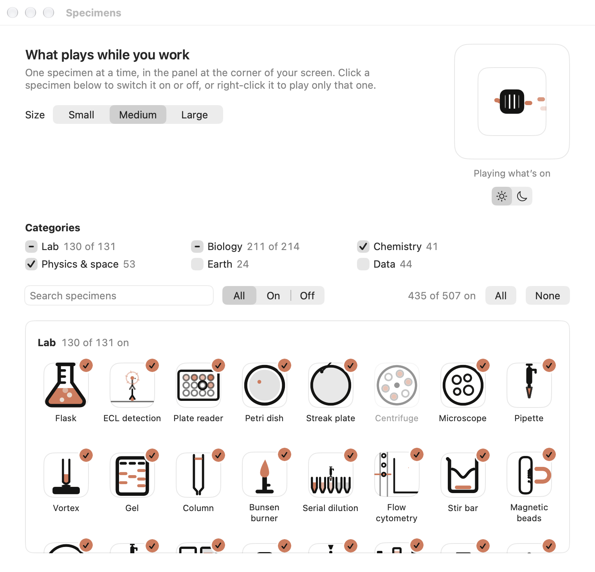

# Bench

**Claude Science as a real Mac app.** A Solanum product.



**Install in one line**: paste into Terminal (Apple silicon, macOS 27):

```sh
curl -fsSL https://raw.githubusercontent.com/samporter14/bench/main/install.sh | zsh
```

Or [download Bench.zip](https://github.com/samporter14/bench/releases/latest/download/Bench.zip) (3 MB); see [Install](#install).

## Why Bench

- **Tiny and light.** A 3 MB download, with no Electron and no bundled
  browser. It uses the WebKit already built into macOS. Bench itself idles at
  0% CPU and about 50 MB of memory, and the page runs in WebKit like a Safari
  tab.
- **Truly Mac native.** Written in Swift with SwiftUI and AppKit: Liquid
  Glass, a real toolbar, menus, keyboard shortcuts, Settings (⌘,) and Find
  (⌘F).
- **Nothing collected.** No Bench account, no analytics, no telemetry, no
  update checks. Bench only talks to Claude Science running on your own Mac,
  and other sites open only when you click a link. Bench reads Claude
  Science and changes nothing in it, except when you press Approve on a
  plan's card. It saves nothing but its own settings.
- **One home for Claude Science.** No lost browser tab. Nothing opens in
  Safari unless you ask, and pop-outs and sign-in windows stay in the app.
- **Know when it needs you.** While a session works, one of 507 little
  animated lab specimens plays in a glass panel in the corner of your screen.
  When a session needs your input, a card there takes you straight to it.
  Later can remind you in 5 or 15 minutes, or after a Nidus focus session.

   
- **Approve a plan from its card.** When a session asks you to approve its
  plan, the card shows the plan's summary, how many steps it has (their
  titles one click away) and Claude's own feasibility estimate, with an
  **Approve** button. Bench checks it's still the
  same plan just before approving; if anything is off, Open takes you to the
  session instead. Never from a Mac notification. Turn it off in Settings →
  General.
- **Mac notifications, if you want them.** Off until you turn on **Also
  send a Mac notification** in Settings → General → Mac notifications. Then
  a session that needs you or stops with an error sends a notification too,
  so you see it in full screen or on your iPhone, and finishes can as well.
  macOS asks your permission once, and you can hide the session and project
  names.
- **Every session in one list.** Click the status in the toolbar, or
  right-click Bench in the Dock, for what needs you, what's working and what
  happened lately, each one click from its session. Press ⌘⇧O to jump to any
  recent session by typing part of its name. Nothing about your sessions is
  saved to disk: Recent lasts until Bench quits.

  
- **A heads-up before you hit a wall.** A card when your plan is nearly
  used up, when at this pace it will run out within 45 minutes, and when it
  resets, and when the session you have open has used most of its context.
  Once a new week starts, a quiet week in review.
- **Plays well with Nidus.** While a [Nidus](https://github.com/samporter14/nidus)
  focus session runs, "Finished" cards wait until it ends and come as one;
  questions and errors still come at once.
- **Optional menu bar specimen.** Turn it on in Settings to see a session
  working, or a count of those waiting, from the menu bar.
- **Usage at a glance.** The title bar shows how full your session's context
  is and how much of your plan is left, with a countdown to when it resets.

  

## Make it yours

Pick how big the specimens play, turn whole categories on or off, or choose
them one by one, in Settings → Specimens: click a specimen to switch it on or
off, or right-click it to play only that one. Star your favorites and switch
Play to Only favorites to play just those; your other picks wait for when
you switch back. Show only the ones that are on, off or starred to check
your picks. The preview plays only what's on, in light or
dark. Hover a specimen to see it play big, with a few words about it. Search
matches what a specimen is about as well as its name, and the Topics menu
beside the search field finds a whole subject at once, "microscopy" say. Turn
on Settings → General → Name the specimen that's playing for its name and a
caption under the session in the panel. Tired of the one playing right
now? Right-click the panel and choose Don't Play. The panel can sit in any
corner of your screen, on any display: Settings → General → Corner and
Screen.



## Install

You need a Mac with Apple silicon (M1 or later) on macOS 27, with
Claude Science installed. Close any Claude Science browser tab first, because
Claude Science runs in one tab at a time. Bench starts Claude Science if it
isn't running and signs you in.

### Easiest: one line in Terminal

```sh
curl -fsSL https://raw.githubusercontent.com/samporter14/bench/main/install.sh | zsh
```

It downloads the latest Bench from this page's releases, puts it in
Applications (quitting and replacing an older one), and opens it. **Run the
same line again to update.** macOS doesn't show its "can't verify" warning
for apps installed this way, because it only flags apps downloaded through a
web browser. You're trusting this page instead, so [install.sh](install.sh)
is short enough to read first.

### Or download it

1. [Download Bench.zip](https://github.com/samporter14/bench/releases/latest/download/Bench.zip)
   and open it.
2. Drag **Bench** into your **Applications** folder, and open it from there
   rather than from Downloads.
3. Open Bench. The first time, macOS blocks it because it isn't from the App
   Store or a registered developer. Click **Done**, then go to **System
   Settings → Privacy & Security**, scroll down, and click **Open Anyway**
   next to Bench.

To update a downloaded copy, quit Bench first with **⌘Q**. Closing its window
isn't enough, because Bench keeps running in the background to watch your
sessions. Then replace it in Applications, open it, and click **Open Anyway**
once more. **Bench → About Bench** shows which version is running.

### If something's off

If Bench ever opens on a "Sign in" screen, click **Sign in**.

If the specimens or the "needs you" cards never show up, open **Help → Bench
Diagnostics**. It checks each step Bench takes to see your sessions and has a
**Copy** button; nothing in it names your projects or sessions. The same
report prints in Terminal with the command below, once macOS has let that
version of Bench open:

```sh
/Applications/Bench.app/Contents/MacOS/Bench --diagnose
```

## Build it yourself

With Xcode 27 installed, run this from the repo's folder:

```sh
Scripts/build-app.sh --open
```

It builds `build/Bench.app` and opens it.

## Notes

- Bench is a personal project, unofficial, and not affiliated with or
  endorsed by Anthropic. It's a work in progress: `TESTING.md` says what has
  been checked live so far.
- `DESIGN.md` is the spec: the look, where the glass goes, and how links are
  routed.
- The screenshots use made-up sessions: `Bench --demo working|card|plan|toolbar|general|specimens`
  shows the real UI with invented names (add `--quiet`, and launch with
  `open -g -n`, to keep it from taking the keyboard), and
  `Bench --render-scenes` records the scene GIF.
- `Sources/Bench/Shared` holds copies from the Science Status droplet, where
  the specimens are written; `Scripts/sync-shared.sh` refreshes them.
- MIT licensed; see [LICENSE](LICENSE).
