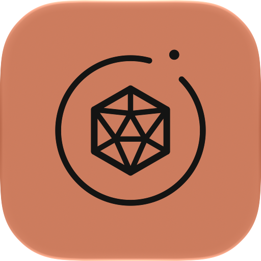
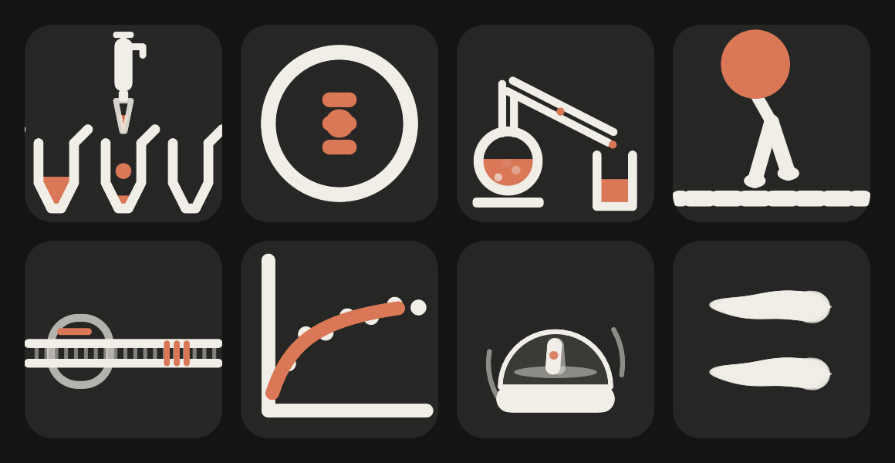
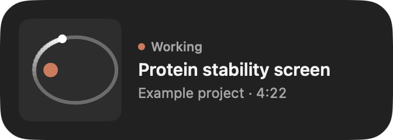
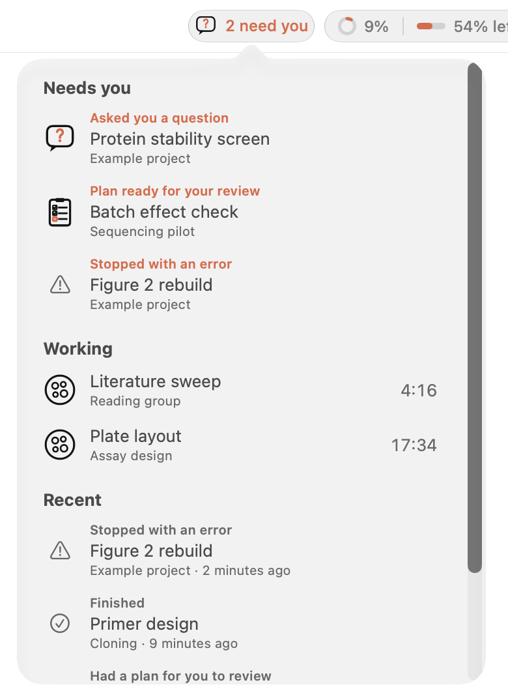
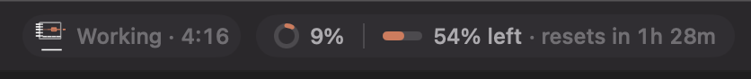
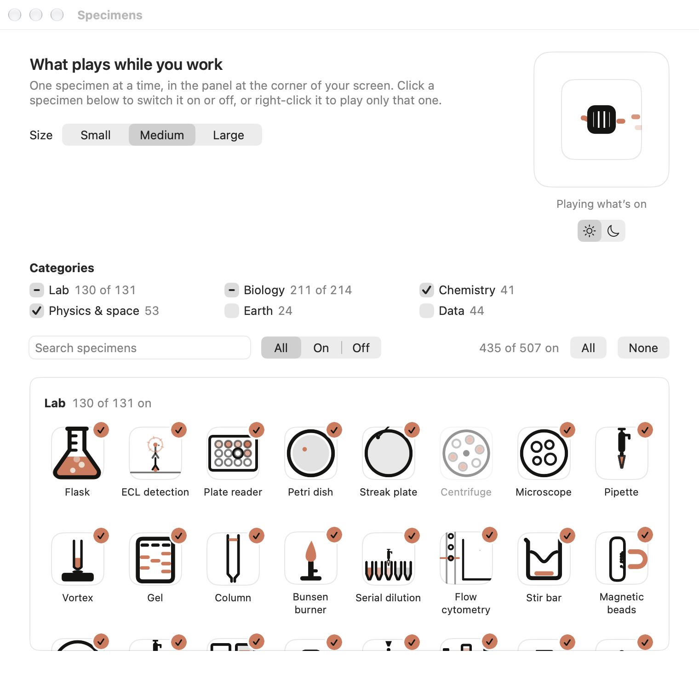

# Capsid

**Claude Science as a real Mac app.** A Solanum product.



**Install in one line**: paste into Terminal (Apple silicon, macOS 27):

```sh
curl -fsSL https://raw.githubusercontent.com/samporter14/bench/main/install.sh | zsh
```

Or [download Bench.zip](https://github.com/samporter14/bench/releases/latest/download/Bench.zip) (15 MB); see [Install](#install).

## Why Capsid

- **Small and light.** A 15 MB download, most of it the six app icons, with
  no Electron and no bundled browser. It uses the WebKit already built into
  macOS. Capsid itself idles at 0% CPU and about 50 MB of memory, and the page
  runs in WebKit like a Safari tab.
- **Truly Mac native.** Written in Swift with SwiftUI and AppKit: Liquid
  Glass, a real toolbar, menus, keyboard shortcuts, Settings (⌘,) and Find
  (⌘F).
- **Nothing collected.** No Capsid account, no analytics, no telemetry. Capsid
  talks to nothing beyond your Mac except links you click, a once-a-day
  update check, which you can turn off, and, if you turn on Capsid on your phone,
  your own paired devices over your Tailscale network, with notifications,
  if you turn them on, carried by Apple's push service and encrypted so only
  your device can read them. Capsid reads Claude Science and changes nothing
  in it, except when you press Approve on a plan's card, send an answer from
  a question's reply window, or answer, approve, send a message or start a
  session from a paired device. It saves nothing but its own settings
  (among them which session you had open, as an id, to reopen it), and the
  files you choose to save.
- **One home for Claude Science.** No lost browser tab. Nothing opens in
  Safari unless you ask, and pop-outs and sign-in windows stay in the app.
- **Know when it needs you.** While a session works, one of 541 little
  animated lab specimens plays in a glass panel in the corner of your screen.
  When a session needs your input, a card there takes you straight to it.
  Later can remind you in 5 or 15 minutes, or after a Nidus focus session.
  When a session stops with an error, the card says why, with **Copy**. If
  you've been away from the Mac for ten minutes, the specimen holds still
  until you're back.

   
- **Approve a plan from its card.** When a session asks you to approve its
  plan, the card shows the plan's summary, how many steps it has (their
  titles one click away) and Claude's own feasibility estimate, with an
  **Approve** button. Capsid checks it's still the
  same plan just before approving; if anything is off, Open takes you to the
  session instead. **Request changes…** lets you type what to change, and
  Claude revises the plan and asks again. Never from a Mac notification.
  Turn it off in Settings → Alerts.
- **Answer from its card.** The card shows what the session asks, with
  **Reply**, which opens a small window beside the panel with what Claude
  said last, to pick an answer (⌘1–⌘9) or type your own and send it (⌘↩).
  It always shows which session and project you're answering, and **Next**
  takes you to the next session waiting. A permission request shows what it
  wants, with **Allow Once** for a read-only tool, **Review** to read code
  before allowing it once, and **Deny**; anything that needs more opens in
  Capsid. Capsid checks it's still the same question or request just before
  sending, and keeps your answer if sending fails. Nothing takes the keyboard
  from what you're doing; only your click does. With Mac notifications on, a
  question with a few choices can be answered from its notification too.
- **Results.** File → Results… (⇧⌘R), the tray in the toolbar, or
  **Results** on a session's Finished card: the files your sessions made, by
  project and session. Preview any of them with Quick Look (Space), drag one
  out to Finder or another app, copy an image, text or PDF, Save… one or Save
  All… of a session into a folder (remembered per project), and jump back to
  the conversation each came from. It reads your most recent sessions when it
  opens, and older ones only when you ask. Quick Look's copies live in a
  private temporary folder that is emptied when the window closes.
- **Mac notifications, if you want them.** Off until you turn on **Also
  send a Mac notification** in Settings → Alerts → Mac notifications. Then
  a session that needs you or stops with an error sends a notification too,
  so you see it in full screen or with the panel off, and finishes can as
  well.
  macOS asks your permission once, and you can hide the session and project
  names.
- **Every session in one list.** Click the status in the toolbar, or
  right-click Capsid in the Dock, for what needs you (longest waiting first,
  anything put off with Later underneath), what's working and what happened
  lately, each one click from its session. Hover a session that needs you to
  reply, approve or allow right there, as on its card. **⌥⌘↓** (File → Next
  Waiting Session) opens the next one waiting, and the next. Press ⌘⇧O to
  jump to any session by typing part of its name or project, however old.
  Capsid reopens the session you had open when it last quit.

  
- **A heads-up before you hit a wall.** A card when your plan is nearly
  used up, when at this pace it will run out within 45 minutes, and when it
  resets, and when the session you have open has used most of its context.
  Once a new week starts, a quiet week in review.
- **Plays well with Nidus.** While a [Nidus](https://github.com/samporter14/nidus)
  focus session runs, "Finished" cards wait until it ends and come as one;
  questions and errors still come at once. If you turn on **Settings → General
  → Share the task I'm viewing with Nidus**, Capsid also writes the focused
  Claude Science task's project and title to a small local file for Nidus.
  It clears the file when you leave that task or switch away from Capsid.
  Conversation text is never included.
- **Quiet while you present.** Turn on **Quiet While Presenting** in
  Settings → Alerts, the Capsid menu or the Dock menu, or add Capsid's filter to a Focus in System
  Settings → Focus (a "Presenting" Focus, say). Until it ends, the specimen
  and its cards stay out of sight, with no sounds or Mac notifications, so
  nothing pops up over your slides with a project's name on it. Afterwards,
  whatever still needs you is there, and what finished comes as one card.
- **Optional menu bar specimen.** Turn it on in Settings to see a session
  working, or a count of those waiting, from the menu bar.
- **Usage at a glance.** The title bar shows how full your session's context
  is and how much of your 5-hour limit is left, with a countdown to when it
  resets (or, if you prefer, whichever limit is lowest: Settings → Usage). A
  weekly limit that's nearly used up shows instead, so it never catches you
  out.

  

## Make it yours

Pick how big the specimens play, turn whole categories on or off, or choose
them one by one, in Settings → Specimens: click a specimen to switch it on or
off, or right-click it to play only that one. Star your favorites and switch
Play to Only favorites to play just those; your other picks wait for when
you switch back. Show only the ones that are on, off or starred to check
your picks. The preview plays only what's on, in light or
dark. Hover a specimen to see it play big, with a few words about it. Search
matches what a specimen is about as well as its name, and the Topics menu
beside the search field finds a whole subject at once, "microscopy" say. Turn
on Settings → Panel → Name the specimen that's playing for its name and a
caption under the session in the panel. Tired of the one playing right
now? Right-click the panel and choose Don't Play. The panel can sit in any
corner of your screen, on any display: Settings → Panel → Corner and
Screen. And Capsid's own icon comes in six of Solanum's colorways (Clay,
Ivory, Slate, two one-color versions and Ivory with a clay capsid): Settings →
General → App icon. It changes the Dock icon while Capsid is open; Finder and
Launchpad keep the Clay one, because macOS doesn't let an app change those
without altering itself.



## Capsid on your phone

Use Claude Science from your iPhone, iPad or another computer while you're
away from your Mac: a private web app that Capsid serves to your own devices
over your [Tailscale](https://tailscale.com) network. **[The setup guide](docs/phone.md)**
takes about five minutes. Nothing is on the
public internet: Capsid listens only on your Mac, and Tailscale Serve passes
on what your devices ask, with a certificate for your tailnet.

- **Now**: what needs you, what stopped with an error, what's working (with
  live clocks) and what happened lately, plus your plan's usage.
- **A session**: its latest reply and the whole conversation (scroll up for
  more), with tool steps as one quiet line each, and the files it made:
  images, documents and tables open on the phone, anything else downloads.
- **Act on it**: answer its question, approve its plan, send it a message
  (it waits for the next pause if Claude is busy) or a photo, and answer its
  permission requests: running code and read-only tools can be allowed once;
  anything that would grant lasting access is Deny or Open on Mac. Capsid
  checks the session hasn't changed on your Mac just before it acts.
- **Watch it work**: while a session works, its reply appears as it's
  written, with what it's doing ("Executing code").
- **Projects**: every project and all its sessions, with search, and a new
  session in any of them.
- **Notifications**, if you turn them on, on each device: when a session
  needs you, stops with an error or (if you like) finishes; by default only
  while you're away from your Mac and without session names. They travel
  through Apple's push service, encrypted so only your device can read them.
- **A count on the Capsid icon** of sessions that need you.
- On iPad, a sidebar and the session side by side.

It's **off** until you turn it on in **Settings → Phone**, which walks you
through six steps and ticks each one off as you go: Tailscale on your Mac,
signed in, HTTPS on, Tailscale on your phone, the switch, and pairing (scan
the QR code, add the page to your Home Screen, open it from there and enter
the one-time code). Settings lists paired devices, each
with Remove (a device unused for 60 days has to pair again), and has two
switches: one for answering, approving and sending messages, one for
browsing projects, full conversations and files. Turning Capsid on your phone
off, or quitting Capsid, stops serving and leaves your other Tailscale Serve
settings as they are.

## Install

You need a Mac with Apple silicon (M1 or later) on macOS 27, with
Claude Science installed. Close any Claude Science browser tab first, because
Claude Science runs in one tab at a time. Capsid starts Claude Science if it
isn't running and signs you in. The first time, a short welcome shows you
around; Help → Welcome to Capsid shows it again.

**Coming from Bench?** Capsid was called Bench until 0.6.0. Installing or
updating it the usual way replaces Bench in Applications with Capsid, and
your settings and paired devices carry over. The download is still called
Bench.zip, and this repository is still `bench`.

### Easiest: one line in Terminal

```sh
curl -fsSL https://raw.githubusercontent.com/samporter14/bench/main/install.sh | zsh
```

It downloads the latest Capsid from this page's releases, puts it in
Applications (quitting and replacing an older one), and opens it. **Run the
same line again to update.** macOS doesn't show its "can't verify" warning
for apps installed this way, because it only flags apps downloaded through a
web browser. You're trusting this page instead, so [install.sh](install.sh)
is short enough to read first.

**Updates.** On unless you turn off **Settings → General → Updates → Check for
updates once a day**: Capsid asks GitHub for its latest release about once a
day. When a newer one is out, a card says so and an **Update** button appears
in the toolbar, with **Install and Reopen**, **Release Notes** and **Skip This
Version**; the Dock icon's menu has an Install item too. The request carries
only the name `Capsid` and its version, nothing about you or your sessions,
though GitHub sees your IP address as any site you visit does.
**Capsid → Check for Updates…** and **Check Now** ask at once, with the
switch off too. Installing runs the line above for you, after telling you that
Capsid will quit, download the new version from GitHub and reopen, and that
your sessions keep running in Claude Science. A copy that isn't in
Applications can't replace itself, so it offers only the release notes.

### Or download it

1. [Download Bench.zip](https://github.com/samporter14/bench/releases/latest/download/Bench.zip)
   and open it.
2. Drag **Capsid** into your **Applications** folder, and open it from there
   rather than from Downloads. If Bench is there from before, quit it and
   move it to the Trash: Capsid replaces it.
3. Open Capsid. The first time, macOS blocks it because it isn't from the App
   Store or a registered developer. Click **Done**, then go to **System
   Settings → Privacy & Security**, scroll down, and click **Open Anyway**
   next to Capsid.

To update a downloaded copy, quit Capsid first with **⌘Q**. Closing its window
isn't enough, because Capsid keeps running in the background to watch your
sessions. Then replace it in Applications, open it, and click **Open Anyway**
once more. **Capsid → About Capsid** shows which version is running.

### If something's off

If Capsid ever opens on a "Sign in" screen, click **Sign in**.

If the specimens or the "needs you" cards never show up, open **Help → Capsid
Diagnostics**. It checks each step Capsid takes to see your sessions and has a
**Copy** button; nothing in it names your projects or sessions. It also says
which Claude Science version Capsid was last checked with, looks (without
changing anything) at the parts of Claude Science's page and API Capsid relies
on, and shows the last time one of them wasn't what Capsid expected: worth a
look after a Claude Science update. The same
report prints in Terminal with the command below, once macOS has let that
version of Capsid open:

```sh
/Applications/Capsid.app/Contents/MacOS/Capsid --diagnose
```

## Build it yourself

With Xcode 27 installed, run this from the repo's folder:

```sh
Scripts/build-app.sh --open
```

It builds `build/Capsid.app` and opens it.

## Notes

- Capsid is a personal project, unofficial, and not affiliated with or
  endorsed by Anthropic. It's a work in progress: `TESTING.md` says what has
  been checked live so far.
- `DESIGN.md` is the spec: the look, where the glass goes, and how links are
  routed.
- The screenshots use made-up sessions: `Capsid --demo working|card|plan|toolbar|general|specimens`
  shows the real UI with invented names (add `--quiet`, and launch with
  `open -g -n`, to keep it from taking the keyboard),
  `Capsid --demo phone-settings --step 1…7` shows Settings → Phone at each
  step of its setup checklist, `Capsid --demo remote` serves the phone page with them on
  `http://127.0.0.1:47280` (pairing code `000000`), and
  `Capsid --render-scenes` records the scene GIF.
- `Sources/Bench/Shared` holds copies from the Science Status droplet, where
  the specimens are written; `Scripts/sync-shared.sh` refreshes them.
- MIT licensed; see [LICENSE](LICENSE).
